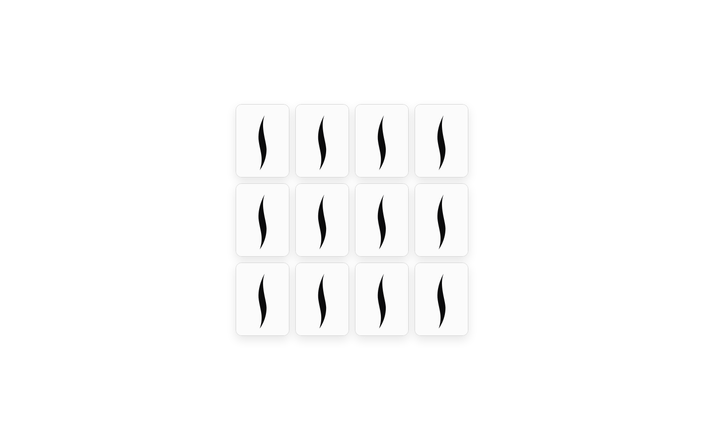

# SEPHORA Memory Card Game

Memory card game developed for Sephora.

## Scripts (package.json)

- `bun run dev`
  - Lance le serveur de dev Vite
  - `--host 0.0.0.0` : écoute sur toutes les interfaces réseau (accès depuis LAN / autres devices)
  - `--port 3000` : force le port 3000

- `bun run build`
  - Build de production (génère le dossier `dist/`)

- `bun run preview`
  - Démarre un serveur local qui sert le build `dist/` via Vite
  - Même host/port que `dev` pour garder une URL stable

- `bun run screenshot`
  - Exécute ton script Node `scripts/screenshot.js` (Playwright) pour générer/mettre à jour des captures

- `bun run lint:scss`
  - Analyse tous les fichiers SCSS dans `src/` avec Stylelint (sans modifier les fichiers)

- `bun run lint:scss:fix`
  - Analyse + applique les corrections automatiques possibles (`--fix`)

- `bun run format`
  - Formate le repo avec Prettier (`--write`)
  - Si tu as `src/**/*.scss` dans `.prettierignore`, Prettier ne touchera pas au SCSS

- `bun run format:check`
  - Vérifie que tout est bien formaté (retourne un code d’erreur si ce n’est pas le cas)
  - Utile en CI pour bloquer un commit “mal formaté”

